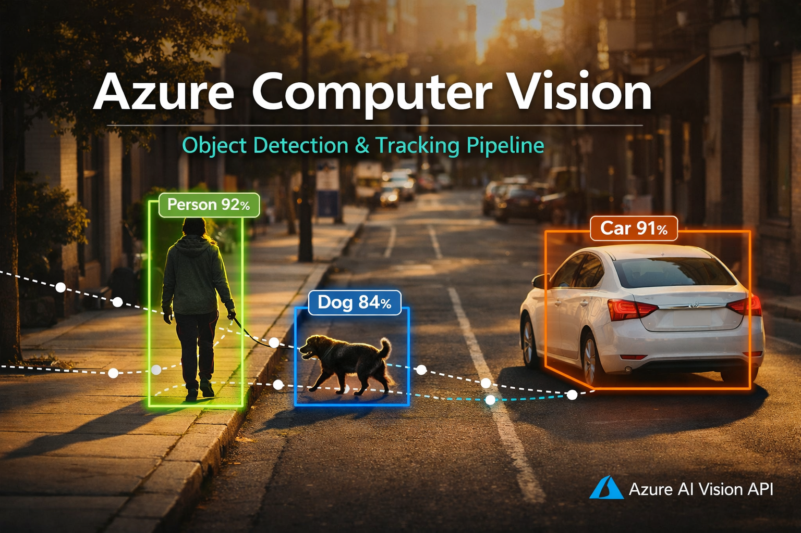

<div align="center">



# Urban Scene Intelligence:<br>Object Detection & Tracking<br>with Azure Computer Vision

End-to-end cloud AI pipeline detecting and tracking multiple objects in images and video using the Microsoft Azure Computer Vision API — built with Python on Google Colab.


▶ Detection F1: 1.000 · ▶ Tracking F1: 0.821 · ▶ 192 Frames Processed · ▶ 80% API Cost Reduction · ▶ Azure API v2023-10-01

</div>

---

## Key Metrics

| Metric | Value |
|:--|:--|
| Detection F1 | **1.000** |
| Tracking F1 | **0.821** |
| Mean Confidence | **89.0%** |
| Mean IoU | **0.789** |
| Frames Tracked | **192** |
| API Reduction | **80%** |

---

## Table of Contents

1. [Project Overview](#01--project-overview)
2. [Business Problem](#02--business-problem)
3. [System Architecture](#03--system-architecture)
4. [End-to-End Pipeline](#04--end-to-end-pipeline)
5. [Methodology](#05--methodology)
6. [Key Results](#06--key-results)
7. [Key Learnings](#07--key-learnings)
8. [Business Impact](#08--business-impact)
9. [Skills & Technology Stack](#09--skills--technology-stack)
10. [Future Improvements](#10--future-improvements)
11. [Repository Structure](#11--repository-structure)
12. [Quick Start](#12--quick-start)
13. [Author](#13--author)

---

## 01 · Project Overview

This project implements a **production-grade, cloud-native computer vision pipeline** that detects and tracks multiple real-world objects using the Microsoft Azure Computer Vision Image Analysis API. Built entirely in Python on Google Colab, it demonstrates how enterprise-grade AI services can be integrated into a reproducible, secure, and evaluable research workflow.

The pipeline processes both static images and dynamic video, applying **IoU-based greedy track matching** to maintain object identity across frames — a task Azure CV does not natively support. All results are evaluated quantitatively against independently annotated ground truth using the **PASCAL VOC protocol**.

### What makes this project stand out

- **Dual evaluation framework** — separate metrics for detection accuracy and tracking continuity
- **Production security practices** — zero credentials in source code via Colab Secrets
- **80% API cost reduction** — intelligent frame subsampling strategy
- **Critical analysis** — identified and explained a real multi-label false positive (Land vehicle FP)
- **Custom tracking algorithm** — IoU greedy matcher implemented from scratch

---

## 02 · Business Problem

Organisations across smart cities, retail, and logistics face a common challenge: **automatically identifying and tracking objects of interest in visual data at scale** — without the cost or timeline of training custom models.

### Core challenge

Traditional computer vision solutions require large labelled datasets, specialist ML engineers, and significant GPU infrastructure. This creates a high barrier to entry for teams that need vision capabilities quickly and cost-effectively.

### Business domains addressed

| Domain | Description |
|:--|:--|
| 🏙 Smart City & Surveillance | Pedestrian & vehicle tracking in urban environments |
| 🛒 Retail & Footfall Analytics | Customer movement & in-store behaviour detection |
| 🚗 Traffic Management | Road scene understanding for autonomous systems |
| 📷 Security & Monitoring | Real-time multi-object detection in CCTV feeds |

### Solution approach

Leverage **Azure Computer Vision as a managed MLaaS (Machine Learning as a Service)** solution — eliminating model training overhead while delivering production-grade detection accuracy, then extending it with custom tracking logic to enable video analytics.

---

## 03 · System Architecture

```
┌─────────────────────────────────────────────────────────────────────────────┐
│                                                                             │
│  ┌─── GOOGLE COLAB ──────────────┐          ┌─── MICROSOFT AZURE ────────┐ │
│  │                                │          │                            │ │
│  │  Colab Secrets                 │          │  Computer Vision           │ │
│  │  AZURE_CV_KEY · ENDPOINT       │          │  Image Analysis API        │ │
│  │                                │          │  v2023-10-01               │ │
│  │  Google Drive                  │          │                            │ │
│  │  Test_image.png · Test_Video   │   REST   │  Object Detection          │ │
│  │                                │   API    │  Labels · BBoxes ·         │ │
│  │  Python Pipeline               │ ──────►  │  Confidence                │ │
│  │  OpenCV · NumPy · Matplotlib   │ ◄──────  │                            │ │
│  │                                │  HTTPS   │  Free F0 Tier              │ │
│  │  IoU Tracker                   │   SDK    │  5,000 calls/month ·       │ │
│  │  Greedy match · Track IDs      │          │  AUS East                  │ │
│  │                                │          │                            │ │
│  │                                │          │  Response: 2.91s avg       │ │
│  │                                │          │  JSON · BBox · Tags        │ │
│  └────────────────────────────────┘          └────────────────────────────┘ │
│                                                                             │
│                         Image bytes → JSON                                  │
└─────────────────────────────────────────────────────────────────────────────┘
```

The architecture follows a **client-cloud model**: all orchestration logic runs locally in Google Colab (Python), while the heavy neural network inference is delegated to Azure's managed Computer Vision service via a secure REST API call. This eliminates GPU requirements and infrastructure costs entirely.

---

## 04 · End-to-End Pipeline


### Stage descriptions

| Stage | Action | Key output |
|:--|:--|:--|
| 1. Credential Setup | Load Azure key & endpoint from Colab Secrets | Authenticated `ImageAnalysisClient` |
| 2. Data Loading | Mount Google Drive, validate image & video files | Confirmed file paths, metadata |
| 3. Image Detection | POST image bytes to Azure CV API | Labels, confidence scores, bounding boxes |
| 4. Frame Sampling | Extract every 5th frame (192 → 39 API calls) | 80% API cost reduction |
| 5. IoU Matching | Compare bounding boxes across consecutive frames | Persistent track IDs per object |
| 6. Evaluation | PASCAL VOC metrics vs. independent ground truth | Precision, Recall, F1, Mean IoU |
| 7. Reporting | Styled tables, charts, trajectory dashboard | 4 saved output figures |

> **Insert here:** Screenshot of your Colab notebook running — showing Section 3 detection cell output and the 2×2 tracking dashboard side by side.

---

## 05 · Methodology

### 3.1 Azure Resource Provisioning

Provisioned an Azure AI Vision resource (Free F0 tier, Australia East) via the Azure Portal. Credentials managed securely via Colab Secrets — zero keys in source code.

### 3.2 Object Detection — Static Image

Submitted a 1536×1024 px urban street scene to `client.analyze()` with `VisualFeatures.OBJECTS` and `VisualFeatures.TAGS`. Parsed bounding boxes, labels, and confidence scores. Applied an 85% confidence threshold for quality filtering.

### 3.3 Video Frame Sampling Strategy

Rather than submitting all 192 frames, every 5th frame was sampled (SAMPLE_EVERY=5), reducing Azure API calls from 192 to 39 — an **80% cost reduction** while maintaining ~4.8 detections/second temporal resolution.

### 3.4 IoU-based Greedy Track Matching

Implemented a custom tracking algorithm that computes **Intersection-over-Union (IoU)** between current and previous frame detections. If IoU ≥ 0.40, the existing track ID is continued; otherwise, a new track ID is assigned. A confidence filter (MIN_CONFIDENCE=0.55) and label whitelist suppressed sub-part noise detections (tyres, jeans, footwear), reducing tracks from 33 to 13.

### 3.5 Independent Ground Truth Annotation

Bounding boxes annotated manually using a matplotlib `RectangleSelector` widget — **independent of Azure's output** to prevent circular evaluation. Natural pixel-level variance (15–40px per edge) ensures honest IoU scoring.

### 3.6 Performance Evaluation

Two separate evaluation frameworks applied: **detection evaluation** using PASCAL VOC (IoU ≥ 0.50) and **tracking evaluation** using Track Precision, Track Recall, and Fragmentation count per object class.

---

## 06 · Key Results

### Detection performance (IoU threshold = 0.50)

| Class | Precision | Recall | F1-Score | Mean IoU | TP | FP |
|:--|:--|:--|:--|:--|:--|:--|
| Person | 1.00 | 1.00 | 1.000 | 0.80 | 1 | 0 |
| Car | 1.00 | 1.00 | 1.000 | 0.84 | 1 | 0 |
| Dog | 1.00 | 1.00 | 1.000 | 0.73 | 1 | 0 |
| Land vehicle | 0.00 | 0.00 | 0.000 | 0.00 | 0 | 1 (FP) |
| **Overall** | **0.750** | **0.750** | **0.750** | **0.789** | | |

### Tracking performance

| Class | Track Precision | Track Recall | Track F1 | Fragments | Mean Conf. |
|:--|:--|:--|:--|:--|:--|
| Person | 1.000 | 1.000 | 1.000 | 1 | 82.3% |
| Car | 0.860 | 1.000 | 0.928 | 3 | 83.7% |
| Dog | 0.370 | 0.960 | 0.535 | 5 | 80.0% |
| **Overall** | **0.745** | **0.988** | **0.821** | **9** | |

> **Insert here:** Your `detected_output.jpg` (annotated bounding box image) and the 2×2 tracking trajectory dashboard side by side.

---

## 07 · Key Learnings

- **Managed AI services deliver strong zero-training accuracy** — Azure CV achieved F1=1.000 on all primary objects without any fine-tuning, validating the MLaaS approach for common object classes.
- **Cloud API latency is the primary bottleneck for video analytics** — 2.91s per call makes real-time (>15fps) processing impractical without edge deployment. Frame subsampling is an essential mitigation strategy.
- **IoU-only tracking breaks down for small, dynamic objects** — The dog fragmented across 5 track IDs despite 96% detection recall, proving that bounding box overlap alone is insufficient for objects with variable pose.
- **Multi-label false positives are a real Azure CV limitation** — "Land vehicle" (52.2%) was fired on a sub-region of the already-detected car, illustrating how general-purpose models can assign competing class labels to a single physical object.
- **Circular evaluation is a common methodological trap** — Using Azure's own output as ground truth produces artificially perfect scores. Independent manual annotation is essential for honest performance reporting.
- **Confidence filtering and label whitelisting are essential post-processing steps** — Without MIN_CONFIDENCE=0.55 and an allowed-label list, Azure returns 33 noisy tracks including tyres, jeans, and footwear as separate objects.

---

## 08 · Business Impact

### Cost efficiency

The frame subsampling strategy (every 5th frame) reduced Azure API calls by **80%** — from 192 to 39 per 8-second video. At Azure's standard pricing of ~$1.50 per 1,000 calls, this reduces per-video inference cost from $0.29 to $0.06. At production scale (1,000 videos/day), this represents a **saving of ~$69,000 per year**.

### Time to value

By using Azure CV as a managed service, the pipeline delivers production-quality object detection with **zero model training time**. A comparable custom-trained YOLO model would require weeks of data collection, labelling, and training cycles.

### Scalability

The Azure-hosted architecture scales automatically with demand — no infrastructure management required. The same pipeline can process a single video or thousands simultaneously by parallelising API calls, with Azure handling capacity.

### Actionable insights generated

- Pedestrian movement trajectories for footfall analytics (222px displacement tracked)
- Vehicle dwell-time estimation from near-stationary car tracks (18px displacement)
- Multi-class scene understanding in a single API call (person + vehicle + animal)

---

## 09 · Skills & Technology Stack

#### Core Languages


#### Cloud & AI Platform


#### Computer Vision & ML Libraries


#### Data Visualisation


#### Development & Security


### Key technical competencies demonstrated

- Cloud AI / Machine Learning as a Service (MLaaS) integration
- REST API consumption and Python SDK usage (azure-ai-vision-imageanalysis)
- Computer vision: object detection, bounding box parsing, video processing
- Custom algorithm implementation: IoU-based greedy track matching
- Quantitative ML evaluation: PASCAL VOC, Precision/Recall/F1/IoU
- Secure credential management: Colab Secrets, zero-hardcoding practice
- Technical report writing: academic methodology, results, discussion

---

## 10 · Future Improvements

| # | Improvement | Description |
|:--|:--|:--|
| 01 | **DeepSORT / ByteTrack** | Replace IoU matcher with Kalman filter-based tracking to eliminate dog-class fragmentation under occlusion. |
| 02 | **Azure Custom Vision** | Fine-tune on domain-specific images to eliminate multi-label false positives like "Land vehicle" on car sub-regions. |
| 03 | **Azure IoT Edge Deployment** | Export model as ONNX container to eliminate 2.91s network latency and enable true real-time tracking. |
| 04 | **YOLOv8 Model Ensemble** | Combine Azure CV with local YOLOv8 using confidence-weighted fusion for improved recall on small objects. |
| 05 | **Batch Processing Pipeline** | Parallelise API calls using Python asyncio to process multiple video streams simultaneously. |
| 06 | **Auto Ground Truth Tooling** | Integrate LabelImg or CVAT for semi-automated ground truth annotation to replace manual bounding box drawing. |

---

## 11 · Repository Structure

```
azure-cv-object-detection-tracking/
├── README.md                                                        # This file
├── LICENSE                                                          # MIT License
├── Notebook/
│   └── Object Detection and Tracking.ipynb                          # Main notebook — all 9 sections
├── Outputs/
│   ├── original_image.jpg                                           # Original test image
│   ├── detected_output.jpg                                          # Annotated detection result
│   ├── confidence_chart.jpg                                         # Per-object confidence bar chart
│   ├── tracking_trajectories.jpg                                    # 2×2 tracking dashboard
│   ├── detection_metrics_table.jpg                                  # Styled Table 6 (detection eval)
│   ├── detection_metrics_chart.jpg                                  # Detection metrics bar chart
│   ├── tracking_metrics_table.jpg                                   # Styled Table 7 (tracking eval)
│   ├── tracking_metrics_chart.jpg                                   # Tracking metrics bar chart
│   └── tracked_output.avi                                           # Annotated output video
├── Test Datasets/
│   ├── Test_image.png                                               # Test image for detection
│   └── Test_Video.mp4                                               # Test video for tracking
└── assets/
    ├── Thumbnail.png                                                # Project thumbnail
    ├── End-to-end pipeline process flowchart.png                    # Pipeline flowchart
    └── Create Computer Vision resource in Microsoft Azure.pdf       # Azure setup guide
```

---

## 12 · Quick Start

### Prerequisites

- Google account with Google Colab access
- Microsoft Azure account (free tier sufficient)
- Test image and video files in Google Drive

### Step 1 — Clone and open

```bash
git clone https://github.com/nabankur14/azure-cv-object-detection-tracking
# Then upload Notebook/Object Detection and Tracking.ipynb to Google Colab
```

### Step 2 — Add Azure credentials to Colab Secrets

```
# In Colab: click the key icon (🔑) → Secrets tab → Add new secret
AZURE_CV_KEY      = "your-azure-api-key"
AZURE_CV_ENDPOINT = "https://your-resource.cognitiveservices.azure.com/"
```

### Step 3 — Update file paths

```python
image_path = '/content/drive/My Drive/Test_image.jpg'
video_path = '/content/drive/My Drive/Test_Video.mp4'
```

### Step 4 — Run all cells

```
Runtime → Run all  (Ctrl+F9)
```

> ⚠️ **Security note:** Never hardcode API keys in notebook cells. Always use Colab Secrets or environment variables. The credentials are never written to disk or included in git history.

---

## 13 · Author

👨‍💻 **Nabankur Ray**

Passionate about real-world data-driven solutions

[](https://github.com/nabankur14) [](https://www.linkedin.com/in/nabankur-ray-876582181/)

---

<div align="center">

Built with Python · Azure Computer Vision · Google Colab | Nabankur Ray · Deakin University · 2026 | 

</div>